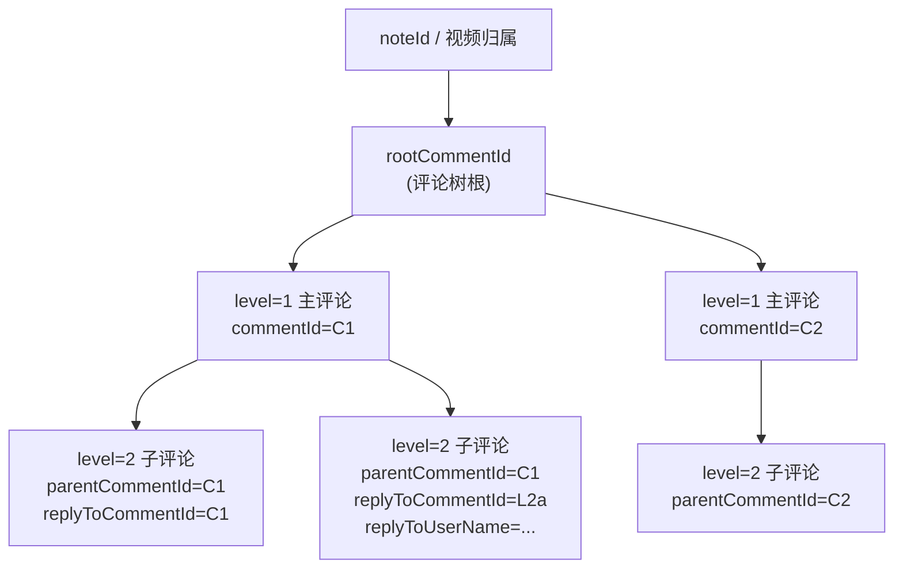
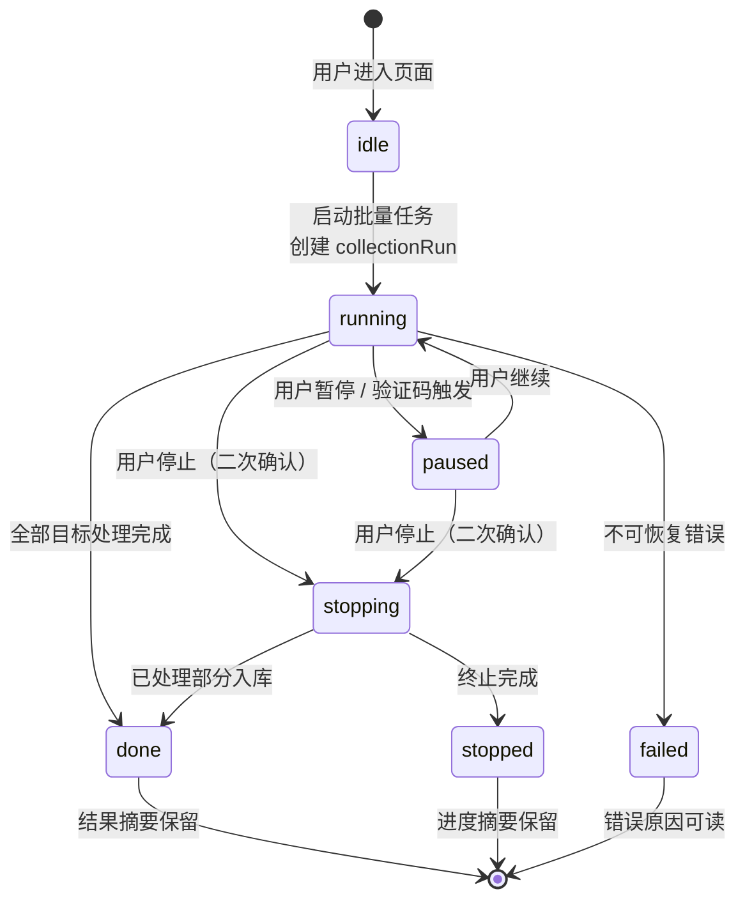
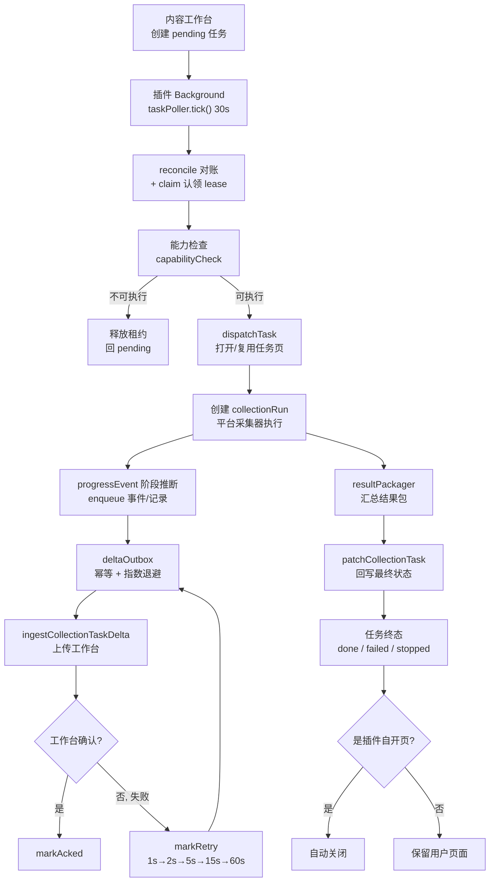
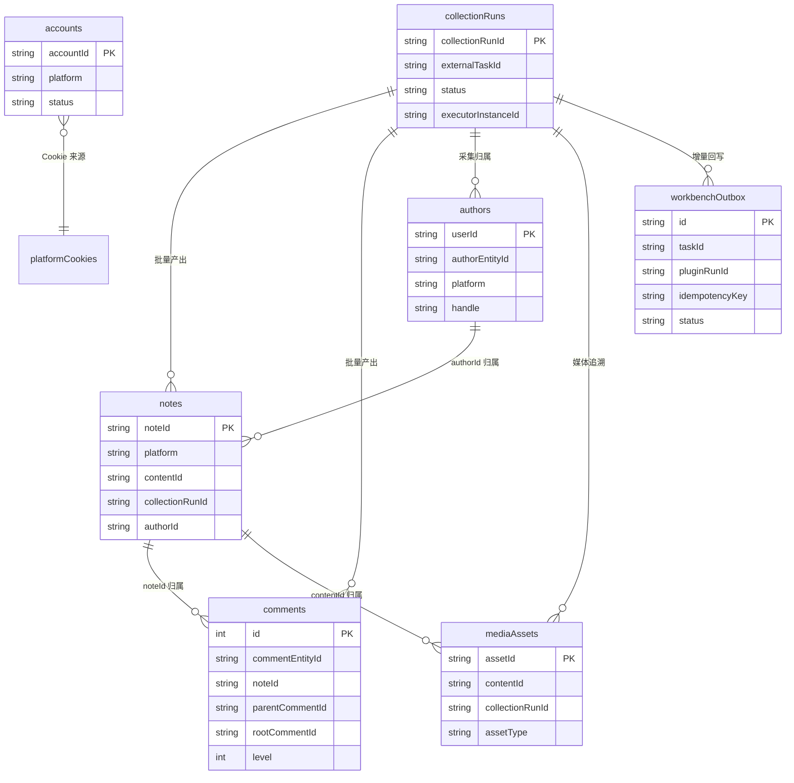
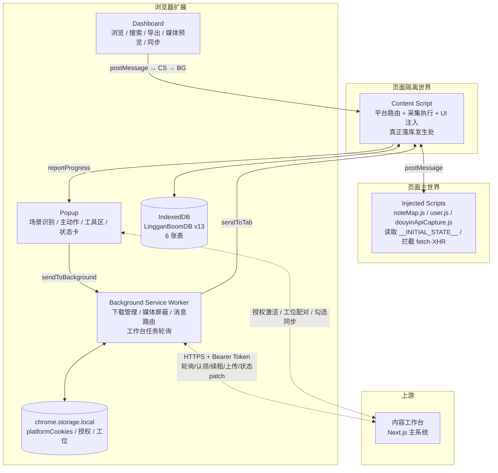
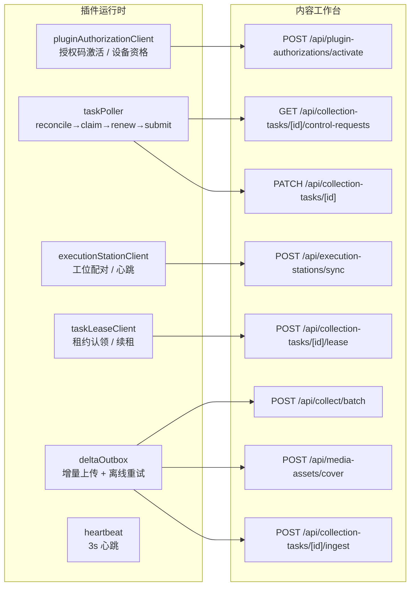
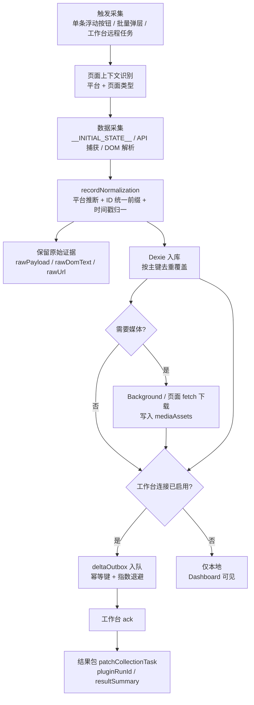

# 灵感爆爆爆 — 统一产品 PRD（插件执行端视角）

> 关联文档：[APP_FLOW.md](APP_FLOW.md) · [TEST_CHECKLIST.md](TEST_CHECKLIST.md) · [../SELECTORS.md](../SELECTORS.md) · [../ARCHITECTURE.md](../ARCHITECTURE.md) · [../technical/DATA_MODEL.md](../technical/DATA_MODEL.md)

## 1. 产品概述

**灵感爆爆爆** 在统一产品里不是一个独立产品，而是"内容工作台"体系中的浏览器执行端。

统一产品的固定分工是：

- 内容工作台：主系统，负责任务入口、Topic 承载、洞察查看、人工评估、推进与复盘沉淀
- 灵感爆爆爆插件：执行端，负责真实网页里的采集、评论展开、媒体捕获、页面上下文识别与结果回传

因此，本 PRD 采用"插件执行端视角"描述产品，不把插件误写成完整主系统。

在这个前提下，**灵感爆爆爆** 仍然是一款 Chrome 扩展插件（Manifest V3，当前版本 2.0.53），帮助用户在小红书与抖音上高效采集内容数据，并提供本地存储、搜索、导出、媒体下载等数据管理能力；同时它还要承担和内容工作台之间的任务桥接、结果同步与远程执行职责。

当前多平台状态（2026-06-25）：
- 小红书：单篇、批量、评论、博主、评论图片区下载链路完整
- 抖音：单条视频采集/下载、分享触发自动采集、单条博主采集、博主页/搜索页批量视频采集、博主页/搜索页批量评论采集已可用
- 抖音仍需继续产品化验收的能力：单条评论体验、评论图片区下载、数据面板二次下载的长时效稳定性
- 工作台协同：Dashboard 勾选同步 `notes / comments / authors` 已可用；单实例自动认领 `pending` 采集任务的轮询链路与结果回写代码已落地，仍待一轮完整实机闭环验收
- 授权体系：插件改为私有授权制；授权码决定使用资格，工位由连接流程自动创建或复用，并由内容工作台管理

### 核心价值

- 作为统一产品的网页内执行端，承接内容工作台下发的真实采集任务
- 作为团队内受控执行端，只有被内容工作台授权的成员 / 设备才可使用插件能力
- 一键采集内容主体信息与互动指标
- 批量采集博主页/搜索页内容，并支持按点赞排序
- 采集评论及子评论，保留后续分析所需的层级关系
- 下载内容媒体与评论图片区高清资源
- 在本地 Dashboard 中完成查看、筛选、导出与二次下载
- 将选中的内容、采集任务状态与结果摘要同步回内容工作台
- 在启用工作台连接后自动轮询可执行的待办采集任务，并将 `pluginRunId / resultSummary / errorMessage` 回写给工作台
- 通过 Popup 的"当前页面上下文 + 主动作区 + 批量任务区 + 工具区 + 任务状态卡"降低首次使用成本
- 通过"Cookie & 账号"管理区提供按当前页面平台获取登录 Cookie 的能力；小红书成功抓取后会自动保存为采集账号，支持多账号轮换规避风控
- 通过统一的页内任务控制台与顶部通知条，让长任务状态更容易理解和控制；统一的是结构与阶段语义，不是平台文案，抖音任务必须显示抖音语义而不是回退小红书标题/按钮；暂停态应保留进度摘要，停止/完成态应短暂保留结果汇总
- 通过统一的评论设置弹层，让小红书与抖音在"评论上限 / 采集深度 / 批量说明"上保持同构体验
- 抖音页内批量配置弹层保持紧凑：只保留标题、一句场景说明、核心参数和操作区，避免被大段说明与重复摘要淹没

### 产品边界

插件负责：

- 网页内采集动作
- 页面交互与上下文识别
- 批量任务执行
- 原始结果、本地缓存与结果包输出
- 向内容工作台回传进度、状态与可导入结果

插件不负责：

- `Topic` 生命周期管理
- 洞察结果的主承载
- 人工评估与采纳决策
- 复盘沉淀与团队知识管理

这些能力统一归属于内容工作台主系统。

### 当前功能矩阵（2026-06-25）

| 平台 | 功能 | 状态 | 备注 |
|------|------|------|------|
| 小红书 | 单篇内容采集 | 已完成 | 当前稳定能力 |
| 小红书 | 批量内容采集 | 已完成 | 搜索页 / 博主页 / 收藏页 |
| 小红书 | 单篇评论采集 | 已完成 | 含子评论 |
| 小红书 | 批量评论采集 | 已完成 | 串行可控 |
| 小红书 | 博主采集 | 已完成 | |
| 小红书 | 评论图片区下载 | 已完成 | |
| 抖音 | 单条视频采集 | 已完成 | 视频弹层 + 分享动作确认 |
| 抖音 | 单条视频下载 | 已完成 | 页面上下文 fetch 链路（D18） |
| 抖音 | 单条博主采集 | 已完成 | |
| 抖音 | 单条评论采集 | 部分完成 | 底层链路可用，且已修复"留空=全量"时的假满进度并补 `stopped + partial result` 自动回归，仍需完整产品化验收 |
| 抖音 | 批量视频采集 | 已完成 | 博主页 / 搜索页作品列表 API 驱动 |
| 抖音 | 批量评论采集 | 已完成 | 博主页 / 搜索页作品列表 + 评论/回复接口 + 页面桥接兜底 |
| 抖音 | 评论图片区下载 | 部分完成 | 高清字段已接通，且已补"高清候选优先 / 非图片 blob 跳过 / background dataUrl 回退"自动回归，待真实有图样本页完整验收 |
| 抖音 | 数据面板二次下载 | 部分完成 | 已支持刷新直链，且已补"空媒体队列刷新 / 旧直链失效重试"自动回归测试，仍待真实长时效回归 |
| 工作台 | Dashboard 勾选同步 | 已完成 | `notes / comments / authors` 三类数据都可同步到内容工作台；大批量评论同步有独立等待窗口，成功数按评论登记结果展示 |
| 工作台 | 自动接单与状态回写 | 部分完成 | `pending` 任务轮询、能力检查、派单、lease、heartbeat、结果包回取与状态 patch 已落地；已补"笔记删除 / 页面错误 / 无权限访问"不再回到待分配循环的失败归类，也已补"页面已产出但结果包交接丢失"失败归类；本地已补强插件自开任务页终态关闭，用户原有页面不误关；自动回归覆盖 `pending -> dispatched/running -> paused/stopped/completed/failed`，待完整实机闭环验收 |
| 工作台 | detail_probe 目标解析 | 已完成 | `resolvePreferredTaskTarget` 三层兜底已用真实页面 probe 校准：带 `xsec_token` 直开 → 本地带 token canonicalUrl → explore 兜底（2026-06-25） |

---

## 2. 功能模块

### 2.0 Popup 总控入口

**入口职责**：
- 识别当前平台与页面场景
- 告诉用户当前页能做什么、不能做什么
- 区分单条动作、批量动作和工具动作
- 在同一张任务状态卡中展示进度、阶段和批量控制
- 与页内任务控制台共享阶段语义，避免 Popup 和页面内状态表达割裂

**当前原则**：
- 顶部头部采用紧凑的双列格局：左侧品牌区垂直居中放置原尺寸长条品牌 banner；右侧上方保留平台 / 主题切换，下方显示较小的"灵感爆爆爆"；不再显示方形 logo 与工具箱副标题
- 先显示"当前页面"
- 再显示"当前内容"动作
- 再显示"批量任务"动作
- 最后显示"数据面板 / 导出 / 数据维护"
- 主动作按钮、工具按钮、弹层确认按钮都必须支持忙碌态：点击后立即禁用重复触发，并显示旋转指示或"执行中 / 获取中 / 导出中"等可读状态
- 危险动作必须显式确认：停止批量任务、删除账号、删除单条数据、批量删除、清空数据前，都要给出风险说明和确认按钮，不能一击即删
- 批量设置弹层必须提供智能默认值：根据平台、页面类型、最近一次选择和任务类型，自动给出更稳妥的默认篇数、评论上限与采集深度

**目标**：
- 新用户首次打开 Popup 时，能在 5 秒内理解当前页可执行的操作
- 单条任务与批量任务共享统一的状态表达
- 不允许再出现"点了没反应""危险动作无确认""空白列表没有解释""不同页面颜色和提示语义不一致"这类基础 UX 断层

### 2.1 内容采集

#### 小红书

**触发方式**：笔记详情页 → 浮动按钮"采集笔记"

**技术路径**：注入脚本读取 `window.__INITIAL_STATE__.note.noteDetailMap`

**关键字段**：
- `noteId / url / title / content / type`
- `images / video / cover`
- `likes / collects / comments / shares`
- `keywords / topicIds / atUserList`
- `ipLocation / lastUpdateTime / shareRestricted / authorFollowed`
- `authorId / authorName / authorAvatar`

**媒体下载**：采集完成后弹窗询问是否下载媒体，并支持按封面、所有图片、Live、视频分项选择后逐个下载。

#### 抖音

**触发方式**：
- 视频弹层页点击"采集当前视频"
- 或点击抖音原生"分享"按钮，插件把这次动作识别为"当前视频确认"

**技术路径**：
- 先解析当前视频上下文
- 再融合页面结构化数据、页面桥接与 detail API
- 下载走页面上下文 fetch 链路，避免页面端受限（D18）

**关键字段**：
- `noteId(dy_前缀) / platformContentId / url / title / content`
- `hashtags / cover / authorId / authorName / handle`
- `videoPlayUrl / videoDownloadUrl / shareText / shareShortUrl`
- `triggerSource / dataSource / platform=douyin`

### 2.2 评论采集

#### 小红书

**触发方式**：笔记详情页 → 浮动按钮"采集评论" → 设置数量上限

**技术路径**：页面评论 API 捕获优先（`comment/page + sub/page`）+ 主动分页补拉 + 自动滚动 / 子评论展开触发加载；若页面未命中 API 捕获则回退 DOM 解析

**关键字段**：
- `commentId / noteId / noteUrl`
- `text / author / profileUrl`
- `time / likes / ipLocation`
- `avatarUrl / authorId`
- `parentCommentId`

#### 抖音

**触发方式**：
- 单条：视频弹层页 → "采集当前评论"
- 批量：博主页或搜索页 → "批量评论"

**技术路径**：
- 先确认当前视频或目标视频列表
- 再调用评论接口与回复接口
- 必要时使用页面桥接补足页面态请求上下文

**结构要求**：
- 包含一级评论和二级评论
- 保留 `parentCommentId / rootCommentId / level / replyToCommentId / replyToUserName`
- 评论必须能明确归属到对应视频

**批量评论规则**：
- 支持 `5 / 10 / 20` 条视频
- 支持按"当前页面顺位前 N 条"或"点赞 Top N"两种选取方式
- 每条视频评论上限由使用人设置
- 留空表示尽量采全量

**评论树层级关系**：



> 一级评论 `parentCommentId` 为空、`rootCommentId` 等于自身；二级评论通过 `parentCommentId` 挂到父评论，通过 `rootCommentId` 指向整棵树的根，`replyToCommentId / replyToUserName` 记录"这条子评论直接回复的是谁"，从而保留多级楼中楼结构。

### 2.3 博主采集

**触发方式**：博主页 → 浮动按钮"采集博主"

**Popup 入口**：
- 小红书博主页 Popup 提供"采集当前博主"
- 抖音博主页 Popup 提供"采集当前博主"

**采集字段**：
- 统一：`userId / name / avatar / description / profileUrl / location / ipLocation`
- 小红书：`redId / keywords / follows / fans / interactions`
- 抖音：`handle / secUserId / follows / fans / interactions / gender / accountStatus / followedByMe`

### 2.4 批量内容采集

#### 小红书

**触发方式**：搜索页 / 博主页 / 发现页 → "批量采集笔记"

**执行方式**：
- 选择数量 `5 / 10 / 20 / 50`
- 搜索页可选小红书原生筛选：排序依据、笔记类型、发布时间；博主页仍可选"按点赞排序取 Top N"
- 搜索页筛选必须先确认选中状态，再等待笔记流刷新并连续稳定，之后才能扫描和采集，避免网络慢时采到旧列表（D23）
- 扫描页面 → 逐条打开笔记 → 采集 → 返回列表页
- 内容工作台下发的小红书 `author_baseline` 首次建档，默认固定为"先采博主，再按当前博主页顺位补前 50 篇"，不走点赞 Top N；作品记录应尽量带封面，详情页缺图时可用博主页卡片封面兜底（D19）

#### 抖音

**触发方式**：博主页或搜索页 → Popup 或页内入口 → "批量视频"

**执行方式**：
- 选择数量 `5 / 10 / 20 / 50`
- 可选"按点赞排序取 Top N"
- 搜索页按当前页面可见顺位优先发现目标；若页面里已捕获到 `aweme` 数据，则优先用它补全媒体与话题字段
- API 仍作为补全与兜底来源，而不是覆盖页面当前顺位
- 若启用 Top N，会先尽量扫描足够多作品后再排序
- 再按选定顺序逐条落库，不依赖用户手动滑动页面
- 若来自搜索页，记录中额外写入 `searchKeyword / searchPageUrl`

**结果要求**：
- 批量采到的视频必须进入数据面板
- 搜索页批量新采到的抖音视频应恢复媒体预览与 `hashtags`
- 后续要能在数据面板再次下载视频

**批量任务生命周期**：



> 断点续跑：批量任务在 `collectionRuns.resumeCheckpoint` 保存 `{targetIds, nextIndex, processedCount}`；恢复时跳过已完成目标，不重复采集。

### 2.5 评论图片区下载

#### 小红书

**触发方式**：笔记详情页 → "评论图片下载"

**功能**：自动滚动评论区收集图片 URL，排除头像和表情，逐个下载。

#### 抖音

**触发方式**：
- 视频弹层页 → "评论图片区下载"
- 或 Popup → "评论图片区"

**功能**：
- 优先解析评论图片的 `origin_url / download_url / medium_url / thumb_url`
- 优先下载高清版本
- 扫描阶段展示的"已发现图片数"必须和后续实际下载队列使用同一套去重口径，不能出现"发现 15 张、下载 8 张"这类自相矛盾的反馈
- 结果可用于后续分析与媒体资产管理

### 2.6 Dashboard

**入口**：Popup → "打开 Dashboard" 或页内浮动入口

**头部原则**：
- 顶部左侧仅保留长条 `LG BOOM banner` 作为品牌识别
- 不再显示方形 logo 或"灵感爆爆爆 数据面板"额外标题行
- header 保持紧凑，避免首屏被品牌区占掉过多高度

**功能**：
- 表格展示已采集的内容/评论/博主数据
- 搜索、筛选、单条删除、全量清空
- CSV / JSON 导出
- 媒体预览
- 对小红书和抖音记录支持从数据面板再次触发媒体下载，并可按封面、所有图片、Live、视频分项选择
- 对小红书评论记录，作品打开/导出/同步优先使用采集时保留的分享页链接（如 `rawUrl` 中的 `xsec_token`），避免回退到安全限制页
- **勾选与批量操作**：`notes / comments / authors` 三个 tab 都支持勾选、批量导出、批量删除
- **内容工作台数据打通**：选中的笔记、评论、博主都可以同步到内容工作台；笔记走选题导入，评论走评论入库，博主走博主导入
- 空状态必须区分三类：正在加载、库里还没有数据、当前筛选条件下无结果；不能全部只写成"暂无数据"
- 表格内与工具栏操作都要提供忙碌态和禁用态，避免重复点击导致重复导出、重复删除或重复同步
- 状态颜色统一使用语义色：成功/已完成用绿色，处理中/提示性状态用蓝色，待处理/需注意用黄色，失败/风险用红色，中性信息用灰色
- Dashboard 顶部通知条与页内 Toast / Popup Notice 共享同一套标题、正文、图标和色彩语义，避免每个入口各说各话

### 2.7 内容工作台协同

**入口职责**：
- 作为内容工作台的网页内重执行端，承接工作台下发的远程采集任务
- 在本地页面环境中完成能力检查、真实执行、落库和结果包生成
- 将 `pluginRunId / resultSummary / errorMessage / progress` 回写给内容工作台
- 通过"授权码 + 自动工位"两层身份把插件使用资格和浏览器执行身份解耦

**当前状态**：
- 已支持插件授权激活；未授权时不开放采集、导出、同步、Cookie/账号管理与远程接单
- 已明确约束：授权码在内容工作台设置里生成，用来决定谁能用插件；工位在授权连接或审批领取时自动创建，用来区分同一账号下的多个浏览器插件
- 已明确约束：普通同步的数据归属于当前登录/绑定的内容工作台使用者账号，不归属于授权码创建者；未绑定使用者时不允许同步
- 已支持在插件里一键切换"线上正式站 `https://lingganboom.fun`"与"本地 3000 `http://localhost:3000`"，并记住最近一次选择，避免线上联通后把本地开发入口挤掉（D24：本地打磨期默认联调本地工作台）
- 已支持 Dashboard 主动同步选中记录到内容工作台
- 已支持 Background 轮询工作台 `pending` 任务并自动认领（走 `reconcile -> claim -> renew -> submit` 链路，不再扫旧任务列表）
- 已支持通过 `WORKBENCH_CAPABILITY_CHECK / WORKBENCH_DISPATCH_TASK / WORKBENCH_GET_RESULT_PACKAGE` 完成接单、派单与结果回取
- 本地已补强任务页回收：插件为工作台任务新开的页面，任务完成 / 失败 / 停止后应自动关闭；用户原本打开并被复用的页面不应被关闭
- 自动接单主链路当前仍需一轮"内容工作台创建任务 -> 插件自动接单 -> 工作台状态推进"的实机闭环验收

**远程任务执行流程**：



**抖音二次下载规则**：
- 若旧直链仍有效，直接下载
- 若旧直链失效，尽量基于 `platformContentId` 重新刷新 detail API 后再下载

---

## 3. 外部依赖风险

> 完整选择器清单：[../SELECTORS.md](../SELECTORS.md)

| 风险等级 | 依赖 | 说明 |
|---------|------|------|
| 低 | 小红书 `__INITIAL_STATE__` | 核心结构化数据来源 |
| 低 | 抖音作品列表 / detail / comments 等接口 | 当前批量能力与视频链路的关键基础 |
| 中 | 评论区 DOM | 小红书与抖音都存在页面结构波动 |
| 中 | 博主页卡片 DOM | 用于页内入口与可视反馈，但不应作为唯一事实源 |
| 中 | 页面桥接上下文 | 抖音评论与 API capture 对页面环境更敏感 |

---

## 4. 反检测机制

| 机制 | 说明 |
|------|------|
| 随机延迟 | 所有操作间加入随机等待 |
| 拟人滚动 | 小步慢滚，避免瞬时到底 |
| 分级节流 | 采集量越大，间隔越保守 |
| 验证码检测 | 检测到验证码自动暂停 |
| 媒体资源屏蔽 | 批量采集时可选屏蔽媒体资源加速 |
| 多账号轮换 | 小红书成功抓取 Cookie 后保存为采集账号，支持后续轮换 |

---

## 5. 数据模型

> 插件以本地 IndexedDB（Dexie）作为执行事实源。同时支持通过 HTTP 与内容工作台交换任务和导入结果；本节描述的是插件本地存储结构（事实源：`src/db/index.js` v13）。

### 5.1 数据库概览

| 属性 | 值 |
|------|------|
| 数据库名 | `LingganBoomDB` |
| ORM | Dexie.js v4 |
| 当前 Schema 版本 | v13 |
| 表数量 | 6 张 Dexie 表 + `chrome.storage.local` 扩展存储 |
| 升级路径 | v1 → v13，每次升级含索引变更说明（见 5.5） |

### 5.2 表结构总览

| 表 | 主键 | 角色 | 关键索引 |
|----|------|------|----------|
| `notes` | `noteId` | 内容主表，跨平台存储小红书笔记与抖音视频 | `platform, contentId, collectionRunId, authorId, publishedAt` |
| `comments` | `++id`（自增） | 评论数据，含层级与归属 | `commentEntityId, platform, contentId, noteId, collectionRunId` |
| `authors` | `userId` | 博主资料 | `authorEntityId, platform, handle, redId, collectionRunId` |
| `collectionRuns` | `collectionRunId` | 批量任务上下文 + 远程任务与本地执行记录映射 | `externalTaskId, executorInstanceId, status, lastHeartbeatAt` |
| `mediaAssets` | `assetId` | 内容媒体与评论图片区资产 | `contentId, collectionRunId, assetType, downloadStatus` |
| `workbenchOutbox` | `id` | 工作台事件/记录增量发件箱（离线重试 + 幂等） | `taskId, pluginRunId, &idempotencyKey(唯一), [status+nextAttemptAt+createdAt]` |
| `accounts` | `accountId` | 采集账号（多账号 Cookie 轮换与配额追踪） | `platform, status, lastUsedAt` |

### 5.3 表字段明细

#### notes（内容主表）

| 字段 | 类型 | 说明 |
|------|------|------|
| `noteId` | string (PK) | 笔记唯一 ID（抖音为 `dy_` 前缀） |
| `contentId` | string | 统一内容实体 ID |
| `platformContentId` | string | 平台原生内容 ID（如抖音 awemeId） |
| `platform` | string | `xhs` / `douyin` |
| `collectionRunId` | string | 所属采集任务 ID（v13 加索引，按任务打包不再全表扫描） |
| `url` / `title` / `content` / `type` | - | 基础信息；`type` 为 normal / video |
| `cover` / `images` / `video` | - | 媒体 URL |
| `likes` / `collects` / `comments` / `shares` | number | 互动指标 |
| `keywords` / `topicIds` / `atUserList` | - | 标签 / 话题 / @用户 |
| `authorId` / `authorEntityId` / `authorName` / `authorAvatar` | - | 作者信息 |
| `releaseDate` / `publishedAt` / `collectedAt` / `createdAt` | - | 时间字段 |
| `ipLocation` / `lastUpdateTime` / `shareRestricted` / `authorFollowed` | - | 探查字段 |
| `syncStatus` / `lastSyncAt` / `mediaDownloadStatus` / `mediaQuality` | - | 同步与媒体状态 |
| `hashtags` / `videoPlayUrl` / `videoDownloadUrl` | - | 跨平台话题与视频直链 |
| `videoStreams` / `imageCandidates` / `livePhotoStreams` | - | 高清候选流（小红书含 h266/h265/h264/av1） |
| `dataSource` / `triggerSource` / `shareText` / `shareShortUrl` / `shareCapturedAt` | - | 来源与分享信息 |
| `collectorVersion` | string | 采集器版本标记 |
| `rawPayload` / `rawDomText` / `rawShareText` / `rawUrl` / `rawSource` | - | 原始证据快照 |

#### comments（评论表）

| 字段 | 类型 | 说明 |
|------|------|------|
| `id` | number (PK, auto) | 自增主键 |
| `commentEntityId` / `commentId` | string | 统一评论实体 ID / 平台评论 ID |
| `platform` / `contentId` / `noteId` / `noteUrl` | - | 归属关系 |
| `text` / `author` / `profileUrl` / `avatarUrl` / `authorId` | - | 评论内容与作者 |
| `likes` | number | 点赞数（v2 新增） |
| `parentCommentId` / `rootCommentId` / `level` | - | 评论树层级（详见 2.2 流程图） |
| `replyToCommentId` / `replyToUserName` | - | 楼中楼直接回复对象 |
| `time` / `publishedAt` / `collectedAt` / `createdAt` | - | 时间字段 |
| `location` / `ipLocation` | - | IP 属地（`location` 保留兼容旧导出） |
| `sortMode` / `collectionRunId` | - | 排序方式与所属任务 |
| `syncStatus` / `collectorVersion` / `raw*` | - | 同步状态与原始证据 |

#### authors（博主表）

| 字段 | 类型 | 说明 |
|------|------|------|
| `userId` | string (PK) | 用户 ID |
| `authorEntityId` / `platformAuthorId` / `platform` | - | 统一作者实体 |
| `collectionRunId` | string | 所属任务（v13 加索引） |
| `handle` | string | 跨平台账号标识（小红书号/抖音号，UI 与导出优先读此字段） |
| `secUserId` / `redId` | - | 抖音 secUid / 小红书号（兼容字段） |
| `name` / `avatar` / `description` / `profileUrl` | - | 基础资料 |
| `location` / `ipLocation` / `gender` / `accountStatus` / `followedByMe` | - | 属地与账号状态 |
| `keywords` / `follows` / `fans` / `interactions` | - | 标签与互动数据 |
| `collectedAt` / `createdAt` / `syncStatus` / `lastSyncAt` / `collectorVersion` / `raw*` | - | 时间与同步状态 |

#### collectionRuns（任务执行记录表）

| 字段 | 类型 | 说明 |
|------|------|------|
| `collectionRunId` | string (PK) | 采集任务唯一 ID |
| `externalTaskId` / `externalTaskType` | - | 内容工作台侧任务 ID 与类型（如 `xhs.batchNotes`） |
| `executorInstanceId` / `protocolVersion` | - | 执行实例标识与协议版本 |
| `platform` / `taskType` / `pageType` / `triggerSource` | - | 任务上下文 |
| `status` | string | `running / paused / stopped / done / failed` |
| `resultUploadStatus` | string | `local_only / pending_upload / packaged` |
| `lastHeartbeatAt` | number | 最近心跳时间戳 |
| `config` / `meta` | object | 任务配置快照与额外上下文 |
| `processedCount` / `nextIndex` / `resumeCheckpoint` | - | 断点续跑快照 |
| `latestSummary` / `error` / `startedAt` / `finishedAt` / `updatedAt` / `createdAt` | - | 摘要与时间字段 |

#### mediaAssets（媒体资产表）

| 字段 | 类型 | 说明 |
|------|------|------|
| `assetId` | string (PK) | 资产唯一 ID |
| `contentId` / `collectionRunId` | - | 所属内容与任务 |
| `assetType` | string | `image` / `video` / `comment_image` 等 |
| `role` | string | `cover` / `body` / `comment` / `avatar` 等 |
| `quality` | string | `origin` / `download` / `medium` / `thumb` 等 |
| `downloadStatus` / `lastResolvedAt` / `createdAt` | - | 状态与时间 |

#### workbenchOutbox（工作台增量发件箱）

| 字段 | 类型 | 说明 |
|------|------|------|
| `id` | string (PK) | 本地队列行 ID |
| `taskId` / `pluginRunId` | - | 工作台任务 ID 与插件本地执行 ID |
| `idempotencyKey` | string (unique) | 幂等键，防止重复事件/记录写入（v12 改唯一索引） |
| `kind` | string | `event` / `record` |
| `status` | string | `pending / in_flight / failed / failed_terminal / acked` |
| `payload` / `snapshot` | object | 待上传内容与可选任务快照 |
| `sequence` / `attemptCount` / `nextAttemptAt` | - | 顺序号、尝试次数、下次允许上传时间 |
| `errorMessage` / `createdAt` / `updatedAt` | - | 失败原因与时间 |

#### accounts（采集账号表）

| 字段 | 类型 | 说明 |
|------|------|------|
| `accountId` | string (PK) | 本地平台账号 ID |
| `name` | string | 账号展示名 |
| `status` | string | 当前账号可用状态 |
| `platform` | string | 平台标识 |
| `lastUsedAt` / `createdAt` | - | 时间字段 |

### 5.4 数据约束与去重规则

- 同一笔记以 `noteId` 去重（覆盖更新）
- 评论通过 `commentId + noteId + platform` 去重（更新旧记录）
- 博主通过 `userId` 去重（覆盖更新）
- 批量任务通过 `collectionRunId` 去重
- 媒体资产通过 `assetId` 去重
- 增量 outbox 通过唯一 `idempotencyKey` 去重（v12 起为唯一索引，升级时清理重复行）
- 批量任务通过 `resumeCheckpoint.targetIds + nextIndex` 恢复，不重复处理已完成目标
- 所有 store 读写时通过 `src/db/recordNormalization.js` 做运行时对齐；`src/db/legacyDataMaintenance.js` 提供一次性历史回填

### 5.5 Schema 迁移历史

| 版本 | 变更要点 |
|------|---------|
| v1 | 初始 schema：notes + comments + authors |
| v2 | comments 新增 `likes` |
| v3 | authors 新增 `profileUrl` |
| v4 | 扩展探查字段索引：地域 / 关系 / 状态 |
| v5 | 多平台支持：三表全部新增 `platform` 索引 |
| v6 | AI-ready 基线：新增 `contentId/platformContentId/authorEntityId`、评论树字段、`collectionRuns`、`mediaAssets` |
| v7 | `mediaAssets` 新增 `collectionRunId` 索引，按任务追溯媒体 |
| v8 | `collectionRuns` 新增远程任务映射字段（`externalTaskId / executorInstanceId / resultUploadStatus / lastHeartbeatAt`） |
| v9 | 新增 `workbenchOutbox`，支持增量上传、离线重试、幂等写入 |
| v10 | `workbenchOutbox` 新增 `[status+nextAttemptAt+createdAt]` 复合索引，避免待上传扫描退化 |
| v11 | 新增 `accounts`，支持多账号 Cookie 轮换 |
| v12 | `workbenchOutbox.idempotencyKey` 改为唯一索引，升级时清理重复行 |
| v13 | `notes / authors` 新增 `collectionRunId` 索引，按任务打包结果不再全表扫描 |

### 5.6 chrome.storage.local 扩展存储

除了 IndexedDB，插件还使用 `chrome.storage.local` 存放非数据记录类状态：

| 键 | 用途 |
|----|------|
| `platformCookies` | 双平台 Cookie 缓存。结构：`{ xhs: { cookies[], cookieString, count, capturedAt }, douyin: {同结构} }`，通过 `chrome.storage.local.get('platformCookies')` 读取 |
| 授权与工位状态 | 授权令牌、执行工位身份、配对状态、最近一次工作台地址选择（线上 / 本地） |
| 任务控制台状态 | 页内控制台最近一次进度摘要、阶段徽章等临时展示态 |

### 5.7 数据层实体关系



---

## 6. 系统架构与数据流

### 6.1 插件上下文架构



**关键边界**：
- 真正的采集执行和落库发生在 Content Script 侧
- 远程任务入口在 Background，但执行仍委派给匹配页面的 Content Script
- Injected Script 运行在页面主世界，能访问 `__INITIAL_STATE__` 和拦截网络请求，通过 `postMessage` 与 Content Script 交换数据

### 6.2 与内容工作台的拓扑



**两层身份**：授权码决定"谁能用插件"，工位决定"是哪一个浏览器插件在接单"。普通同步的数据归属于当前登录/绑定的内容工作台使用者账号，不归属于授权码创建者。

### 6.3 主采集数据流



### 6.4 进度阶段与错误映射

进度事件按固定阶段推断（`progressEvent.js`）：

```
CONTEXT_CHECK → DISCOVERING → COLLECTING → DOWNLOADING → PERSISTING → FINALIZING
```

错误统一映射为 8 类（`errorMapper.js`），便于工作台侧做归类展示：

| 类别 | 含义 |
|------|------|
| `CONTEXT` | 页面上下文不匹配 / 目标不可达 |
| `AUTH` | 授权失效 / 工位未配对 |
| `NETWORK` | 网络请求失败 |
| `PLATFORM_BLOCK` | 平台风控 / 验证码 / 限流 |
| `STORAGE` | IndexedDB 写入失败 |
| `DOWNLOAD` | 媒体下载失败 |
| `USER_CANCEL` | 用户主动停止 |
| `INTERNAL` | 插件内部异常 |

### 6.5 支持的远程任务类型

| 任务类型 | 平台 | 监控路由 |
|----------|------|----------|
| `xhs.batchNotes` | 小红书 | 批量采集笔记 / `keyword_patrol` 表层 / `detail_probe` 详情 |
| `xhs.batchComments` | 小红书 | 批量采集评论 |
| `xhs.collectAuthor` | 小红书 | 采集博主 / `author_baseline` / `author_patrol` |
| `xhs.authorNoteLinks` | 小红书 | 发现博主主页历史笔记链接 |
| `douyin.batchNotes` | 抖音 | 批量采集视频 |
| `douyin.batchComments` | 抖音 | 批量采集评论 |
| `douyin.collectAuthor` | 抖音 | 采集博主 |
| `douyin.singleComments` | 抖音 | 单视频评论采集 |
| `douyin.commentImageDownload` | 抖音 | 评论图片下载 |

**监控原则**：默认做轻量"看见"（`surfaceOnly`），不自动深采评论；只有 `detail_probe` 或用户手动深采才打开候选内容页补全详情。

---

## 附录：文档同步约定

本 PRD 与以下文档保持联动，任一能力/字段/状态变更须同步更新（详见 `CLAUDE.md` 文档同步硬门禁）：

- 用户流程 → [APP_FLOW.md](APP_FLOW.md)
- 验收清单 → [TEST_CHECKLIST.md](TEST_CHECKLIST.md)
- 系统架构 → [../ARCHITECTURE.md](../ARCHITECTURE.md)
- 数据模型明细 → [../technical/DATA_MODEL.md](../technical/DATA_MODEL.md)
- 消息协议 → [../technical/MESSAGE_PROTOCOL.md](../technical/MESSAGE_PROTOCOL.md)
- 选择器 → [../SELECTORS.md](../SELECTORS.md)
- 决策日志 → [../decisions/index.md](../decisions/index.md)
